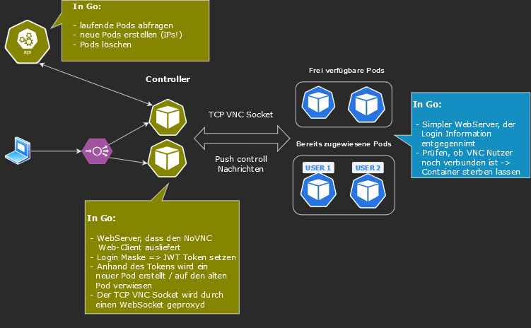

Container image for running LFS.X inside a container and making it accessible over a web browser.

## Architecture

This project consists out of two individual programs / containers playing together to server the LFS.X.

* The [Controller project](/controller/) contains the web interface the user sees. It provides a login mechanism to set a JWT Cookie with the login credentials and a NoVNC web client to proxy the *VNC TCP socket* to an *HTTP Web Socket*.
It is also responsible to create the LFS.X containers on the fly via the Kubernetes API
* In the [second project](/lfsx/) the LFS.X with a VNC Server is running. This program receives the JWT Cookie and authenticates the user agains the LFS.X. Now the user is able to interact with the LFS.X until he drops the connectin.

For a better understanding a drawing of the basic architecture is attached below.



## VNC protocol

There are two VNC "protocols" / clients implemented in this app:

- NoVNC
- Guacamole. This does currently ONLY work for firefox - and not for chrome

Because *NoVNC* requires a lot of bandwidth, we added the *Guacamole* protocol which is much more efficient when displaying texts. 

### Performance

In this section you get an overview of how much bandwidth and ressources are needed for the "VNC stack".

For performance comparisons, sysbench **(single threaded)** was run on different servers.

```sh
sysbench cpu --threads=1 run
```

| Score  | CPU                    | Server         |
|--------|:----------------------:|:-------------- |
`53.100` | *AMD Ryzen 5 5600X*    | **Reference** (non hama for good performance)
`11.150` | *Intel Xeon Gold 6240* | **esxi18** test system for kubernetes

### Resource usage

Test environment:

- lin2001 using the *esxi18* server
- resoulution of *2560 x 1440*
- heavy scroling on a [wikipedia page](https://de.wikipedia.org/wiki/Elefanten). That's a good test because it has a few images and much text
- *high* picture quality for *NoVNC* and *medium* for guacamole (*medium* is a little pixeled for NoVNC)

Results:

- Sway:   25%   (Single Threaded)
- WayVNC: 50%   (Multi Threaded)
- Guacd:  110%  (Mostly single Threaded - scrolling was't fully smooth). For reference: 85% (scrolling was smooth)
- XPRA:   110%
- Network:
  - Guacamole: 18 Mbit
  - NoVNC:     30 Mbit
  - XPRA:      50 Mbit
- FPS (gefühlt)
  - Guacamole: NoVNC x 2
  - XPRA: Smooth with a few pixelations

---

Because this program was originally designed for the LFS.X, the above tests are only informative for the general performance. The usages within the LFS.X and a common resolution of *1920 x 1080*  are as follows:

- Netzwerk:
  - Guacamole: 5 Mbit
  - NoVNC:     18 Mbit
  - XPRA:      16 Mbit / 28 Mbit